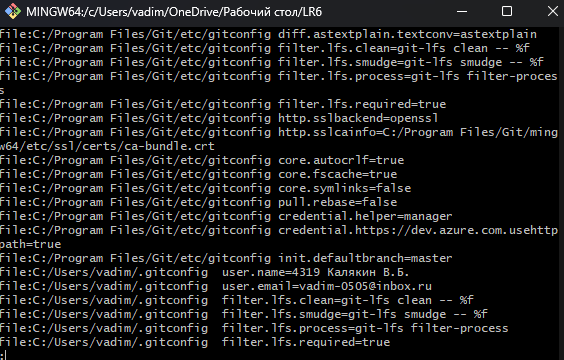
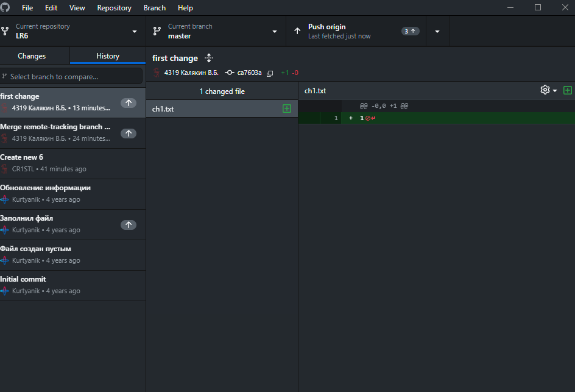
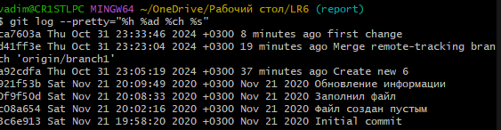

# LR6
Лабораторная работа №6
### Скриншот из консоли

### Скриншот из сторонней программы

### Скриншот с историей операций

## Лог команд:
```
git clone https://github.com/CR1STL/LR6
cd "C:\Users\vadim\OneDrive\Рабочий стол\LR6"git pull
git log
git log origin/branch1
git status
git merge branch1
git branch -D branch1
git push origin -d branch1
git add .
git commit -m "first change"
git add .
git commit -m "second change"
git reset --hard HEAD~
git branch report
git checkout report
git log --pretty="%h %ad %ch %s"
```
